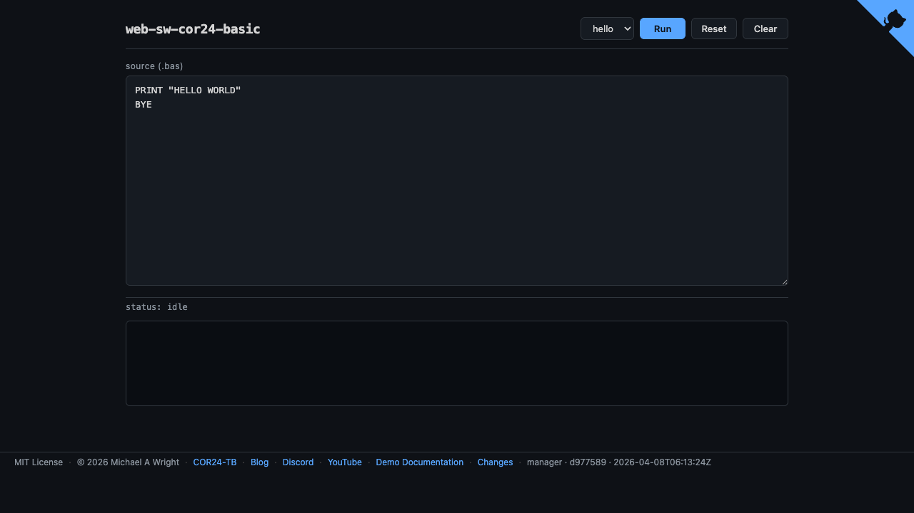

# web-sw-cor24-basic

Browser-based COR24 BASIC v1 sandbox. Write and run 1970s-style
line-numbered BASIC programs on the COR24 p-code virtual machine, directly
in your browser. Zero install.

**Live demo**: https://sw-embed.github.io/web-sw-cor24-basic/

Part of the [Software Wrighter COR24 Tools Project](https://sw-embed.github.io/web-sw-cor24-demos/#/).



## How it works

The BASIC interpreter (Pascal compiled to p-code `.p24`) runs on the COR24
p-code VM (`pvm.s`) inside the COR24 hardware emulator (`EmulatorCore`).
BASIC source is fed as UART input; output is collected from UART TX.

```
Browser runtime:
  pvm.s binary  -> load at 0x000000 into EmulatorCore
  basic.p24     -> load at 0x010000 (p-code, relocated)
  BASIC source  -> feed as UART input (sys 2 / GETC)
  EmulatorCore.run_batch(...) until p-code VM halt
  UART TX bytes -> output panel (strip '>' prompts)
```

## Build locally

```bash
# Ensure basic.p24 is built in the sibling repo
cd ../sw-cor24-basic && ./scripts/build-basic.sh

# Copy the interpreter binary
cp ../sw-cor24-basic/build/basic.p24 assets/

# Serve locally (dev mode)
./scripts/serve.sh

# Build pages for GitHub Pages deployment
./scripts/build-pages.sh
```

## Controls

- **Demo dropdown** -- select a bundled `.bas` example
- **Run / Stop** -- execute the BASIC program (toggles to Stop while running)
- **Reset** -- reload current demo, discard edits
- **Clear** -- clear output panel
- **Ctrl/Cmd+Enter** -- run from keyboard
- **Esc** -- stop running program

## Architecture

Two levels of interpretation: COR24 emulator runs `pvm.s` (the p-code VM),
which in turn executes `basic.p24` (the BASIC interpreter). This is the
same pattern used by [`web-sw-cor24-pcode`](../web-sw-cor24-pcode).

- **Frontend**: Yew 0.21 (CSR), WASM
- **CPU**: [`cor24-emulator`](../sw-cor24-emulator)
- **P-code VM**: [`pvm.s`](../sw-cor24-pcode/vm/pvm.s) assembled at build time
- **P-code loader**: [`pa24r`](../sw-cor24-pcode/assembler)
- **BASIC interpreter**: [`sw-cor24-basic`](../sw-cor24-basic) (Pascal -> p-code)

## Sibling repos

| Repo | Role |
|------|------|
| [sw-cor24-basic](https://github.com/sw-embed/sw-cor24-basic) | BASIC interpreter source |
| [sw-cor24-emulator](https://github.com/sw-embed/sw-cor24-emulator) | COR24 hardware emulator |
| [sw-cor24-pcode](https://github.com/sw-embed/sw-cor24-pcode) | P-code VM, assembler, linker |
| [web-sw-cor24-pcode](https://github.com/sw-embed/web-sw-cor24-pcode) | Browser p-code debugger (same pattern) |
| [web-sw-cor24-snobol4](https://github.com/sw-embed/web-sw-cor24-snobol4) | Browser SNOBOL4 sandbox (GH Pages pattern) |

## Links

- Blog: [Software Wrighter Lab](https://software-wrighter-lab.github.io/)
- Discord: [Join the community](https://discord.com/invite/Ctzk5uHggZ)
- YouTube: [Software Wrighter](https://www.youtube.com/@SoftwareWrighter)

## Copyright

Copyright (c) 2026 Michael A. Wright

## License

MIT -- see [LICENSE](../sw-cor24-basic/LICENSE) for details.
